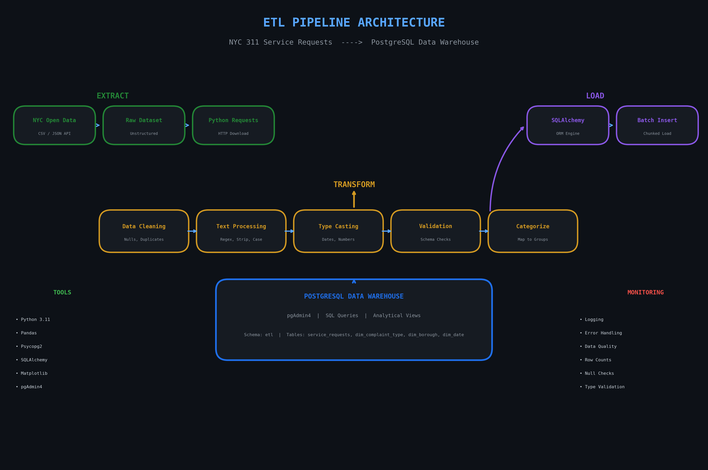
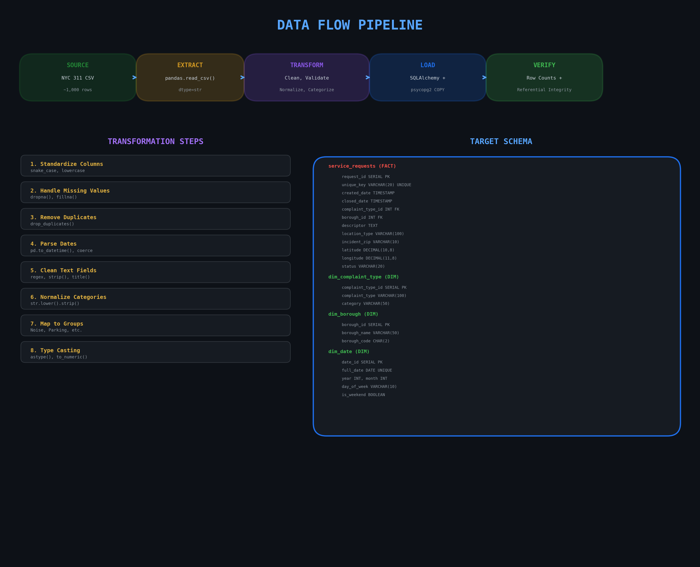
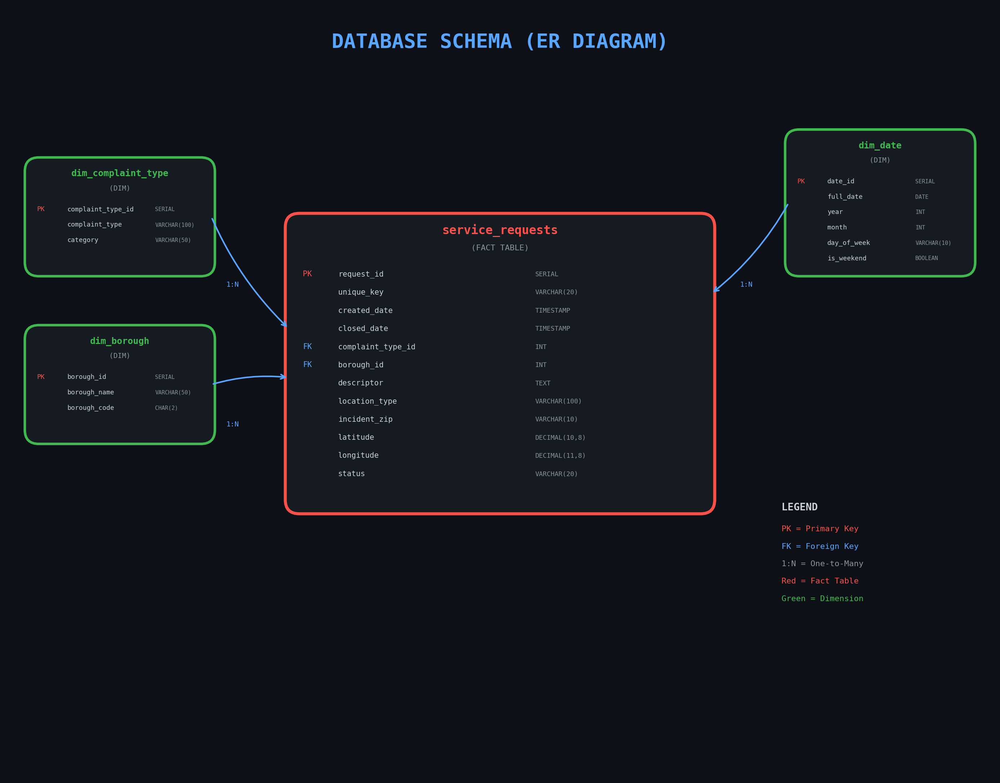

<p align="center">
  
</p>

<h1 align="center">NYC 311 ETL Pipeline</h1>

<p align="center">
  <b>Extract</b> &nbsp;|&nbsp; <b>Transform</b> &nbsp;|&nbsp; <b>Load</b> &nbsp;|&nbsp; <b>Visualize</b>
</p>

<p align="center">
  
  
  
  
  
</p>

---

## Table of Contents

- [Overview](#overview)
- [Architecture](#architecture)
- [Data Flow](#data-flow)
- [Database Schema](#database-schema)
- [Prerequisites](#prerequisites)
- [Installation](#installation)
- [Project Structure](#project-structure)
- [ETL Process](#etl-process)
  - [1. Extract](#1-extract)
  - [2. Transform](#2-transform)
  - [3. Load](#3-load)
- [Analytics & Visualization](#analytics--visualization)
- [Sample Queries](#sample-queries)
- [Screenshots](#screenshots)
- [Troubleshooting](#troubleshooting)
- [License](#license)

---

## Overview

This project is a **production-ready ETL (Extract, Transform, Load) pipeline** built with Python. It processes real-world unstructured data from the **NYC 311 Service Requests** dataset, transforms it through multiple cleaning and normalization stages, and loads it into a **PostgreSQL data warehouse** using a **star schema** design. Finally, it generates analytical visualizations from the structured data.

### Key Features

| Feature | Description |
|---------|-------------|
| **Star Schema** | Fact table + 3 dimension tables for analytical queries |
| **Data Quality** | Null handling, deduplication, type casting, validation |
| **Text Normalization** | Standardizes inconsistent borough names, complaint types, statuses |
| **Category Mapping** | Groups 40+ complaint types into 7 logical categories |
| **Bulk Loading** | Uses SQLAlchemy + PostgreSQL COPY for fast inserts |
| **Analytical Views** | Pre-built SQL views for instant charting in DBeaver |
| **Environment Safety** | Credentials stored in `.env`, never committed to Git |

### Dataset

- **Source:** [NYC Open Data - 311 Service Requests](https://opendata.cityofnewyork.us/)
- **Format:** CSV (unstructured, messy text fields)
- **Size:** 1,000 records (sample) / 42M+ available via API
- **Challenges:** Missing values, duplicates, inconsistent categories, mixed date formats

---

## Architecture

<p align="center">
  
</p>

### Architecture Layers

| Layer | Technology | Purpose |
|-------|-----------|---------|
| **Source** | NYC Open Data API | Free public dataset |
| **Extract** | Python + pandas | Read CSV, handle encoding, chunk processing |
| **Transform** | pandas + numpy | Clean, normalize, validate, categorize |
| **Load** | SQLAlchemy + psycopg2 | Star schema creation, bulk COPY insert |
| **Storage** | PostgreSQL 15+ | Relational data warehouse |
| **Analytics** | DBeaver / pgAdmin4 | SQL queries, views, dashboards |
| **Visualization** | matplotlib | Automated chart generation |

---

## Data Flow

<p align="center">
  
</p>

### Transformation Pipeline (8 Steps)

| Step | Operation | Method |
|------|-----------|--------|
| 1 | **Column Standardization** | `str.lower()`, `str.replace()` |
| 2 | **Missing Value Handling** | `fillna()`, `dropna()` on critical fields |
| 3 | **Duplicate Removal** | `drop_duplicates(subset=['unique_key'])` |
| 4 | **Date Parsing** | `pd.to_datetime()` with error coercion |
| 5 | **Text Cleaning** | `str.strip()`, regex, title case |
| 6 | **Category Standardization** | Custom mapping function |
| 7 | **Type Casting** | `to_numeric()`, zip code extraction |
| 8 | **Validation** | Row counts, bounds checks, null assertions |

---

## Database Schema

<p align="center">
  
</p>

### Star Schema Design

A **star schema** is the industry standard for data warehouses. It consists of one central fact table surrounded by dimension tables.

#### Fact Table: `etl.service_requests`

| Column | Type | Description |
|--------|------|-------------|
| `request_id` | SERIAL PK | Surrogate key |
| `unique_key` | VARCHAR(20) | Original NYC 311 ID |
| `created_date` | TIMESTAMP | When the request was submitted |
| `closed_date` | TIMESTAMP | When resolved (NULL if open) |
| `complaint_type_id` | INT FK | → dim_complaint_type |
| `borough_id` | INT FK | → dim_borough |
| `descriptor` | TEXT | Detailed description |
| `location_type` | VARCHAR(100) | Where it occurred |
| `incident_zip` | VARCHAR(10) | 5-digit ZIP code |
| `latitude` | DECIMAL(10,8) | GPS latitude |
| `longitude` | DECIMAL(11,8) | GPS longitude |
| `status` | VARCHAR(20) | Open / Closed / In Progress |

#### Dimension Tables

| Table | Columns | Records |
|-------|---------|---------|
| `etl.dim_complaint_type` | complaint_type_id, complaint_type, category | ~30 |
| `etl.dim_borough` | borough_id, borough_name, borough_code | 6 |
| `etl.dim_date` | date_id, full_date, year, month, day_of_week, is_weekend | ~365 |

---

## Prerequisites

| Software | Version | Download |
|----------|---------|----------|
| Python | 3.11+ | [python.org](https://www.python.org/downloads/) |
| PostgreSQL | 15+ | [postgresql.org](https://www.postgresql.org/download/) |
| DBeaver Community | 24.x | [dbeaver.io](https://dbeaver.io/download/) |
| pgAdmin 4 | 8.x | [pgadmin.org](https://www.pgadmin.org/download/) |

---

## Installation

### Step 1: Clone the Repository

```bash
git clone https://github.com/YOUR_USERNAME/etlpipeline.git
cd etlpipeline
```

### Step 2: Create Virtual Environment

```bash
python3 -m venv .venv
source .venv/bin/activate
```

### Step 3: Install Dependencies

```bash
pip install -r requirements.txt
```

### Step 4: Configure Environment Variables

```bash
cp .env.example .env
nano .env
```

Edit `.env` with your PostgreSQL credentials:

```env
DB_HOST=localhost
DB_PORT=5432
DB_NAME=mojabaza
DB_USER=admin
DB_PASSWORD=your_password_here
```

> **Security Note:** `.env` is listed in `.gitignore` and will never be committed to GitHub.

### Step 5: Set Up PostgreSQL Database

1. Open **pgAdmin 4** → create database `mojabaza`
2. Connect with **DBeaver** → host: `localhost`, port: `5432`
3. Verify connection with test query:
   ```sql
   SELECT version();
   ```

### Step 6: Import Raw Data

Download the NYC 311 CSV from [NYC Open Data](https://opendata.cityofnewyork.us/) or use your own extract.

```bash
python3 scripts/import_csv.py /path/to/erm2-nwe9.csv
```

### Step 7: Run the ETL Pipeline

```bash
python3 src/etl_pipeline.py
```

Expected output:
```
============================================================
ETL PIPELINE: public.nyc_311_raw -> etl.* (Star Schema)
============================================================

[1/4] EXTRACT...
      Extracted: 1,000 rows

[2/4] TRANSFORM...
      After cleaning: 1,000 rows

[3/4] Creating dimensions...
      Complaint types: 27
      Boroughs: 6
      Dates: 365
      Fact table: 1,000 rows

[4/4] LOADING...

============================================================
VERIFICATION
============================================================
  etl.dim_complaint_type: 27 rows
  etl.dim_borough: 6 rows
  etl.dim_date: 365 rows
  etl.service_requests: 1,000 rows

============================================================
ETL COMPLETE!
============================================================
```

### Step 8: Generate Charts

```bash
python3 scripts/generate_charts.py
```

Charts are saved to the `images/` folder.

---

## Project Structure

```
etlpipeline/
|
|-- .env                          # Your secrets (NEVER commit!)
|-- .env.example                  # Template for .env
|-- .gitignore                    # Files excluded from Git
|-- requirements.txt              # Python dependencies
|-- README.md                     # This file
|-- SECURITY.md                   # Security guidelines
|-- QUICKSTART.md                 # Quick reference card
|
|-- src/                          # Source code
|   |-- __init__.py
|   |-- etl_pipeline.py           # Main ETL pipeline
|   |-- setup_database.sql        # PostgreSQL schema creation
|   |-- analytics_views.sql       # Analytical SQL views
|
|-- scripts/                      # Helper scripts
|   |-- __init__.py
|   |-- import_csv.py             # CSV -> PostgreSQL importer
|   |-- generate_charts.py        # Chart generator from DB
|
|-- images/                       # Diagrams & charts
|   |-- banner.png
|   |-- etl_architecture_diagram.png
|   |-- data_flow_diagram.png
|   |-- er_diagram.png
|   |-- execution_dashboard.png
|   |-- chart_1_boroughs.png
|   |-- chart_2_categories.png
|   |-- chart_3_top10.png
|   |-- chart_4_status.png
|   |-- chart_heatmap.png
|
|-- data/                         # Data folder (empty in repo)
|   |-- .gitkeep
|
|-- docs/                         # Additional documentation
```

---

## ETL Process

### 1. Extract

Reads raw CSV from PostgreSQL staging table `public.nyc_311_raw`:

```python
df = pd.read_sql("SELECT * FROM public.nyc_311_raw", engine)
```

Handles:
- 44 columns (including new fields like `descriptor_2`, `council_district`)
- All values as strings initially (prevents type inference errors)
- Multiple null representations: `''`, `'NULL'`, `'N/A'`, `'  '`

### 2. Transform

#### 2.1 Column Standardization
```python
df.columns = df.columns.str.strip().str.lower().str.replace(' ', '_')
# "Complaint Type" -> "complaint_type"
```

#### 2.2 Missing Value Handling
```python
df = df.dropna(subset=['unique_key', 'created_date', 'complaint_type'])
df['descriptor'] = df['descriptor'].fillna('Unknown')
```

#### 2.3 Date Parsing
```python
df['created_date'] = pd.to_datetime(df['created_date'], errors='coerce')
```

#### 2.4 Text Normalization
```python
borough_map = {
    'MANHATTAN': 'Manhattan',
    'BROOKLYN': 'Brooklyn',
    'QUEENS': 'Queens',
    'BRONX': 'Bronx',
    'STATEN ISLAND': 'Staten Island'
}
df['borough'] = df['borough'].replace(borough_map)
```

#### 2.5 Category Mapping
```python
def map_category(ct):
    ct_lower = str(ct).lower()
    if 'noise' in ct_lower: return 'Noise'
    elif 'parking' in ct_lower: return 'Parking'
    elif 'sanitation' in ct_lower: return 'Sanitation'
    elif 'water' in ct_lower or 'plumbing' in ct_lower: return 'Infrastructure'
    elif 'street' in ct_lower or 'traffic' in ct_lower: return 'Transportation'
    elif 'vehicle' in ct_lower: return 'Vehicle'
    else: return 'Other'

df['category'] = df['complaint_type'].apply(map_category)
```

### 3. Load

Creates star schema and bulk-loads data:

```python
# Schema creation
conn.execute(text("CREATE SCHEMA etl;"))
conn.execute(text("CREATE TABLE etl.dim_complaint_type (...)"))
conn.execute(text("CREATE TABLE etl.dim_borough (...)"))
conn.execute(text("CREATE TABLE etl.service_requests (...)"))

# Bulk insert
df.to_sql('service_requests', engine, schema='etl', if_exists='append', index=False)
```

---

## Analytics & Visualization

### Analytical Views

After running ETL, create views in DBeaver:

```sql
-- Borough statistics
SELECT * FROM etl.vw_borough_stats;

-- Category distribution
SELECT * FROM etl.vw_category_stats;

-- Top 10 complaint types
SELECT * FROM etl.vw_top_complaints;

-- Status distribution
SELECT * FROM etl.vw_status_distribution;

-- Category vs Borough matrix
SELECT * FROM etl.vw_category_borough_matrix;
```

### Generated Charts

| Chart | Query | File |
|-------|-------|------|
| Bar Chart | `vw_borough_stats` | `chart_1_boroughs.png` |
| Pie Chart | `vw_category_stats` | `chart_2_categories.png` |
| Horizontal Bar | `vw_top_complaints` | `chart_3_top10.png` |
| Status Bar | `vw_status_distribution` | `chart_4_status.png` |

---

## Screenshots

### DBeaver - Database Navigator

<p align="center">
  
</p>

### Chart 1: Requests by Borough

<p align="center">
  
</p>

### Chart 2: Category Distribution

<p align="center">
  
</p>

### Chart 3: Top 10 Complaint Types

<p align="center">
  
</p>

### Chart 4: Status Distribution

<p align="center">
  
</p>

### Chart 5: Heatmap - Category vs Borough

<p align="center">
  
</p>

---

## Sample Queries

### Top Complaint Types by Borough
```sql
SELECT 
    b.borough_name,
    ct.complaint_type,
    COUNT(*) as total
FROM etl.service_requests sr
JOIN etl.dim_borough b ON sr.borough_id = b.borough_id
JOIN etl.dim_complaint_type ct ON sr.complaint_type_id = ct.complaint_type_id
GROUP BY b.borough_name, ct.complaint_type
ORDER BY total DESC
LIMIT 10;
```

### Open Requests Analysis
```sql
SELECT 
    b.borough_name,
    COUNT(*) as open_count,
    ROUND(AVG(EXTRACT(EPOCH FROM (CURRENT_TIMESTAMP - sr.created_date))/86400), 1) as avg_days_open
FROM etl.service_requests sr
JOIN etl.dim_borough b ON sr.borough_id = b.borough_id
WHERE sr.status = 'In Progress'
GROUP BY b.borough_name
ORDER BY open_count DESC;
```

### Monthly Trend
```sql
SELECT 
    d.year,
    d.month,
    ct.category,
    COUNT(*) as request_count
FROM etl.service_requests sr
JOIN etl.dim_date d ON DATE(sr.created_date) = d.full_date
JOIN etl.dim_complaint_type ct ON sr.complaint_type_id = ct.complaint_type_id
GROUP BY d.year, d.month, ct.category
ORDER BY d.year, d.month;
```

---

## Troubleshooting

| Issue | Solution |
|-------|----------|
| `ModuleNotFoundError: No module named 'pandas'` | Activate venv: `source .venv/bin/activate` |
| `password authentication failed` | Check `.env` credentials; verify PostgreSQL is running |
| `relation "etl.vw_borough_stats" does not exist` | Run `src/analytics_views.sql` in DBeaver first |
| `extra data after last expected column` | CSV has more columns than table; use `import_csv.py` |
| Charts not generating | Ensure ETL pipeline ran successfully and views exist |

---

## Security

See [SECURITY.md](SECURITY.md) for detailed guidelines.

**Quick rules:**
- Never commit `.env` (contains passwords)
- Never commit `logs/` (may contain sensitive data)
- Never commit `.dbeaver/` (stores connection passwords)
- Use `.env.example` as a template for new team members

---

## License

This project is licensed under the MIT License. The NYC 311 dataset is provided by NYC Open Data under public domain.

---

<p align="center">
  Built with Python, PostgreSQL, and DBeaver Community
</p>
